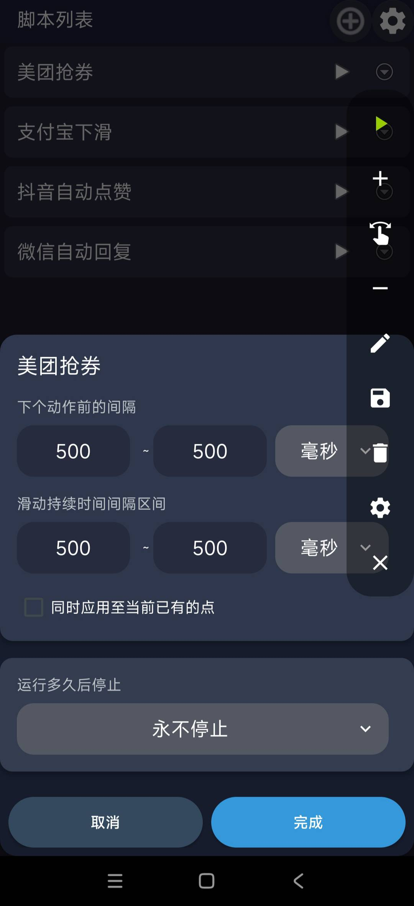
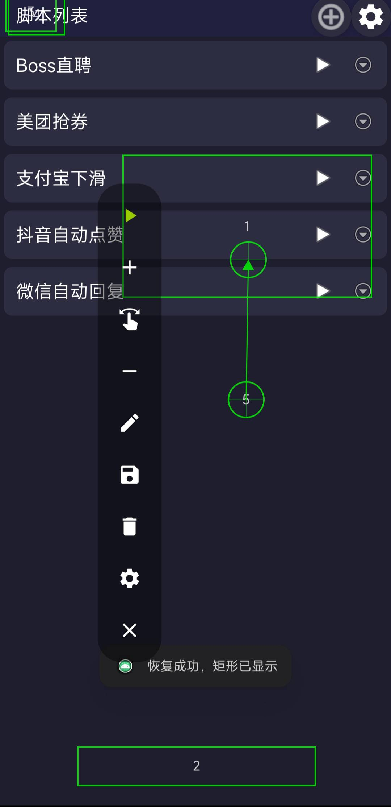

# AutoClicker

**Random Area · Random Interval · Smart Auto-Click | Android Automation Script**

[](https://github.com/Sun3299/AutoClicker/blob/main/LICENSE)
[](https://kotlinlang.org/)
[](https://developer.android.com/)

> AutoClicker is an intelligent Android auto-clicking script tool. Its core differentiator: **random-area taps** and **random time intervals** — designed to mimic human behavior and evade app detection. With floating window controls and script management, it handles all your repetitive automation needs.

---

## ⭐ Key Highlights (vs. Other Auto-Clickers)

| Feature | Why It Matters |
|---------|----------------|
| 🎯 **Random Area** | Unlike fixed-coordinate clickers, taps land at a **random point within a defined rectangle** — mimics real human taps, evades bot detection |
| ⏱ **Random Interval** | Delay between actions is **randomly chosen from a min~max range** — no mechanical rhythm, harder to detect |
| 🎲 **Random Swipe Duration** | Swipe gestures also support randomized duration for natural-feeling motion |
| 🪟 **Floating Window Control** | Each script has its own floating control window — start/stop anytime without switching screens |
| ⏱ **Three Stop Strategies** | Never stop / by duration (H:M:S) / by count — flexibly matches your use case |
| 🌙 **Dark Theme UI** | Eye-friendly dark theme with Material Design, card-based script management |

---

## Features

### 🎯 Random Area Tap

Traditional auto-clickers tap the **same fixed coordinate** every time — trivial for apps to detect as a bot.

AutoClicker defines clicks as a **rectangular region (Rect)**. Each execution picks a **random point within that region**:

```
Defined area (top-left → bottom-right)
  (x1, y1) ┌─────────────────┐
           │  ● ← random hit 1  │
           │       ● ← hit 2 │     Every tap lands somewhere
           │   ● ← hit 3     │     different inside the box
           │        ● ← hit 4 │
  (x2, y2) └─────────────────┘
```

Combined with random intervals, this produces a "human-like" clicking pattern.

### ⏱ Random Interval

The wait time between actions isn't fixed — it's a **random value between min and max**:

```
Action A ──[random wait 300~800ms]──▶ Action B ──[random wait 200~600ms]──▶ Action C
```

### 👆 Mixed Swipe + Click Scripts

A single script can contain multiple **click actions** and **swipe actions**, executed in order:

```
「Game Combo」Script
  Action 1: Tap [Area A]  interval 100~300ms
  Action 2: Swipe [Area B→C]  duration 200~400ms
  Action 3: Tap [Area D]  interval 150~350ms
  ...loop
```

### ⏱ Three Stop Strategies

| Mode | Behavior | Use Case |
|------|----------|----------|
| **Never Stop** | Loops continuously until manually stopped | Long-running挂机, monitoring |
| **By Duration** | Auto-stops after set hours / minutes / seconds | Timed tasks |
| **By Count** | Auto-stops after N cycles | Batch operations |

### 🪟 Floating Window Control

Each script is tied to its own floating window — check status and start/stop instantly without leaving your current app.

### ⚙️ Flexible Time Units

Time parameters support three units freely, no manual conversion needed:
- **Milliseconds (ms)** — fine-grained control
- **Seconds (s)** — everyday use
- **Minutes (min)** — long intervals

---

## UI Preview

### Script List



### Running Example



---

## Architecture

```
┌─────────────────────────────────────────────────────┐
│                     AutoClicker                      │
│                    Android App                       │
├─────────────────────────────────────────────────────┤
│  UI Layer                                            │
│  ┌──────────────────┐  ┌──────────────────┐        │
│  │ MainActivity     │  │ ScriptListActivity │        │
│  └────────┬─────────┘  └────────┬─────────┘        │
│  ┌────────┴──────────────────────┴────────┐         │
│  │ BottomSheet (Action Editor / Settings / Stop) │  │
│  └──────────────────────────────────────────┘        │
├─────────────────────────────────────────────────────┤
│  Script Layer                                        │
│  ┌──────────────┐  ┌──────────────┐  ┌──────────┐  │
│  │ Script      │  │ ScriptAction  │  │ Runtime   │  │
│  │             │  │ Click/Swipe  │  │ Strategy  │  │
│  └──────────────┘  └──────────────┘  └──────────┘  │
│  ┌──────────────┐  ┌──────────────┐  ┌──────────┐  │
│  │ScriptSettings│  │  MarkInfo    │  │ TimeUnit │  │
│  └──────────────┘  └──────────────┘  └──────────┘  │
├─────────────────────────────────────────────────────┤
│  Executor Layer                                      │
│  ┌──────────────┐  ┌──────────────┐  ┌──────────┐  │
│  │ClickExecutor │  │SwipeExecutor │  │ActionTask│  │
│  │(random-area) │  │              │  │          │  │
│  └──────────────┘  └──────────────┘  └──────────┘  │
│  ┌────────────────────────┐  ┌─────────────────┐   │
│  │ ScriptScheduler          │  │ScriptAction     │   │
│  │ (loop execution)         │  │Calculator       │   │
│  └────────────────────────┘  └─────────────────┘   │
├─────────────────────────────────────────────────────┤
│  Service Layer                                       │
│  ┌──────────────────────────────┐ ┌─────────────┐  │
│  │AutoClickAccessibilityService │ │Permission    │  │
│  │(gesture simulation)          │ │Checker       │  │
│  └──────────────────────────────┘ └─────────────┘  │
├─────────────────────────────────────────────────────┤
│  Floating Window Layer                               │
│  ┌──────────────────────────────┐                   │
│  │ FloatingWindowManager       │                   │
│  │(per-script floating control)│                   │
│  └──────────────────────────────┘                   │
└─────────────────────────────────────────────────────┘
```

---

## Project Structure

```
AutoClicker/
├── src/main/
│   ├── java/com/example/autoclicker/
│   │   ├── AutoClicker.kt                  # Application class
│   │   ├── service/                        # Service Layer
│   │   │   ├── AutoClickAccessibilityService.kt  # Accessibility Service
│   │   │   └── PermissionChecker.kt              # Permission utility
│   │   ├── script/                         # Script Layer
│   │   │   ├── model/
│   │   │   │   ├── Script.kt              # Script entity
│   │   │   │   ├── ScriptAction.kt        # Action model (Click/Swipe sealed class)
│   │   │   │   ├── ScriptSettings.kt      # Script settings (time units)
│   │   │   │   ├── RuntimeStrategy.kt      # Stop strategy (RunMode sealed class)
│   │   │   │   ├── MarkInfo.kt            # Area mark info
│   │   │   │   └── TimeUnit.kt            # Time unit (ms/s/min)
│   │   │   ├── executor/                  # Executors
│   │   │   │   ├── ClickExecutor.kt       # Random-area click executor
│   │   │   │   ├── SwipeExecutor.kt       # Swipe executor
│   │   │   │   ├── ScriptScheduler.kt     # Script scheduler (loop)
│   │   │   │   ├── ActionTask.kt          # Action task wrapper
│   │   │   │   └── ScriptActionCalculator.kt  # Param validation & calculation
│   │   │   ├── scheduler/
│   │   │   └── ui/floating/              # Floating window management
│   │   └── ui/                           # UI Layer
│   │       ├── activity/
│   │       │   ├── MainActivity.kt
│   │       │   └── ScriptListActivity.kt
│   │       ├── component/
│   │       └── dialog/
│   ├── res/
│   │   ├── layout/
│   │   ├── values/
│   │   ├── xml/
│   │   │   └── accessibility_service_config.xml
│   │   ├── drawable/
│   │   └── mipmap-*/
│   └── AndroidManifest.xml
├── build.gradle.kts
├── proguard-rules.pro
└── .gitignore
```

---

## Core Code

### Random Area Tap (ClickExecutor)

Each tap lands at a randomly chosen point inside a rectangle:

```kotlin
// Click defined as rectangular region
data class Click(
    var clickRect: Rect,        // (x1,y1) top-left → (x2,y2) bottom-right
    var delayMinMs: Long = 0,   // Random interval min
    var delayMaxMs: Long = 500  // Random interval max
) : ScriptAction()

// Execution: random hit within region
val realX = randomInRange(clickRect.left, clickRect.right)
val realY = randomInRange(clickRect.top, clickRect.bottom)
performClick(realX, realY)
```

### Random Swipe Duration

```kotlin
data class Swipe(
    var startX: Int, var startY: Int,
    var endX: Int, var endY: Int,
    var durationMinMs: Long = 200,  // Duration random min
    var durationMaxMs: Long = 500,  // Duration random max
    var delayMinMs: Long = 0,        // Interval random min
    var delayMaxMs: Long = 500       // Interval random max
) : ScriptAction()
```

### Three Stop Strategies

```kotlin
sealed class RunMode {
    object NeverStop : RunMode()                   // Never stops
    data class ByDuration(                         // Stops by duration
        val hour: Int = 0,
        val minute: Int = 0,
        val second: Int = 0
    ) : RunMode()
    data class ByCount(val times: Int = 10)       // Stops by count
}
```

---

## Tech Stack

| Technology | Version | Notes |
|------------|---------|-------|
| **Language** | Kotlin 1.9+ | Android preferred |
| **Min SDK** | 26 (Android 8.0) | Accessibility service requirement |
| **Target SDK** | 36 | Latest Android |
| **Architecture** | Clean Architecture | UI / Script / Executor / Service layers |
| **UI** | ViewBinding + Material Design | Type-safe view binding |
| **Build** | Gradle 8.x Kotlin DSL | Modern build system |

---

## Permissions

| Permission | Purpose |
|------------|---------|
| `BIND_ACCESSIBILITY_SERVICE` | Core permission for gesture simulation |
| `SYSTEM_ALERT_WINDOW` | Floating window display and control |

The app checks permissions on startup and guides users to system settings if needed.

---

## Build

```bash
# Clone
git clone https://github.com/Sun3299/AutoClicker.git
cd AutoClicker

# Open in Android Studio (auto Gradle sync)

# Debug APK
./gradlew assembleDebug

# Release APK (requires signing config)
./gradlew assembleRelease
```

---

## License

[MIT License](https://github.com/Sun3299/AutoClicker/blob/main/LICENSE)


